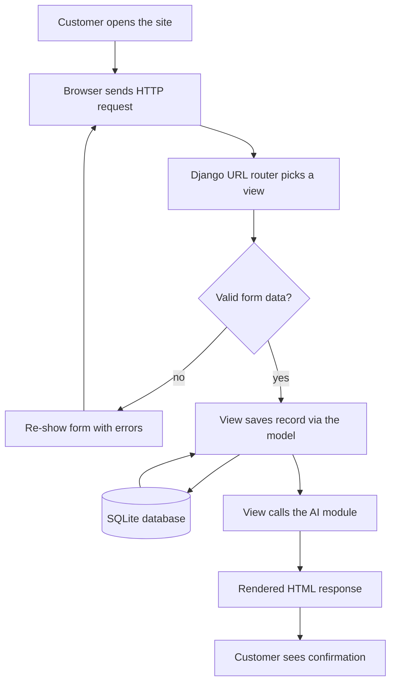
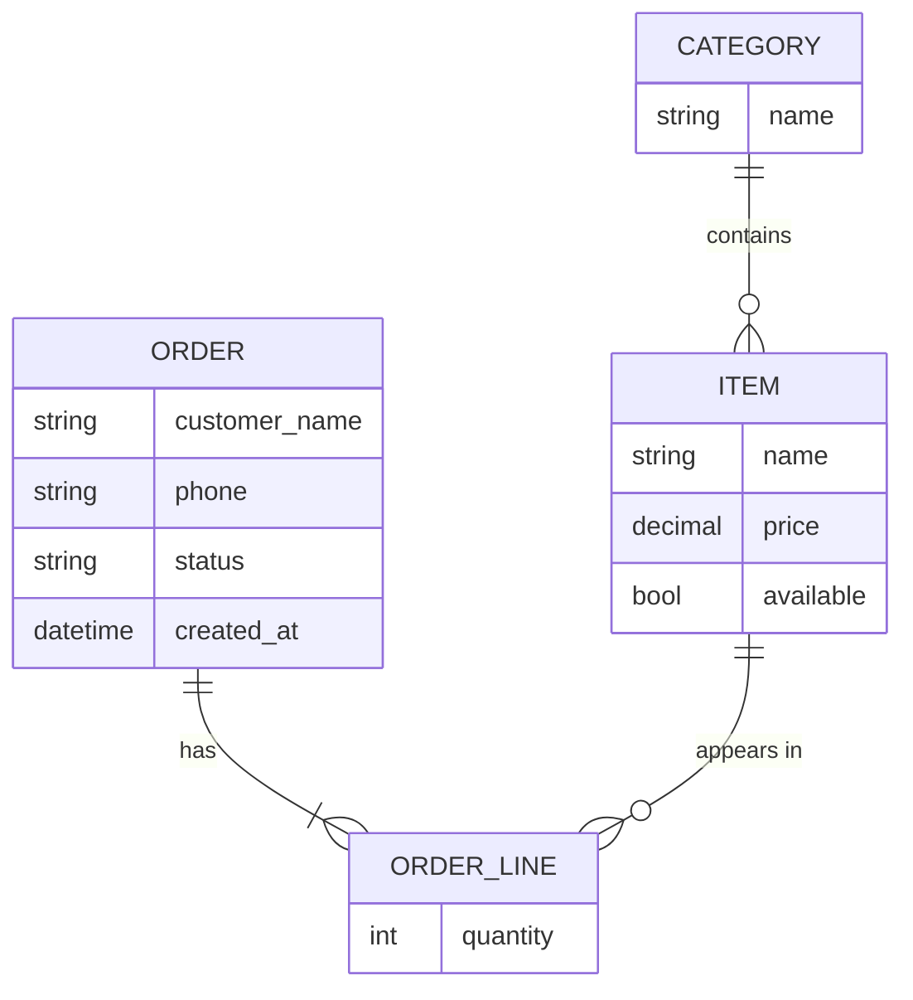
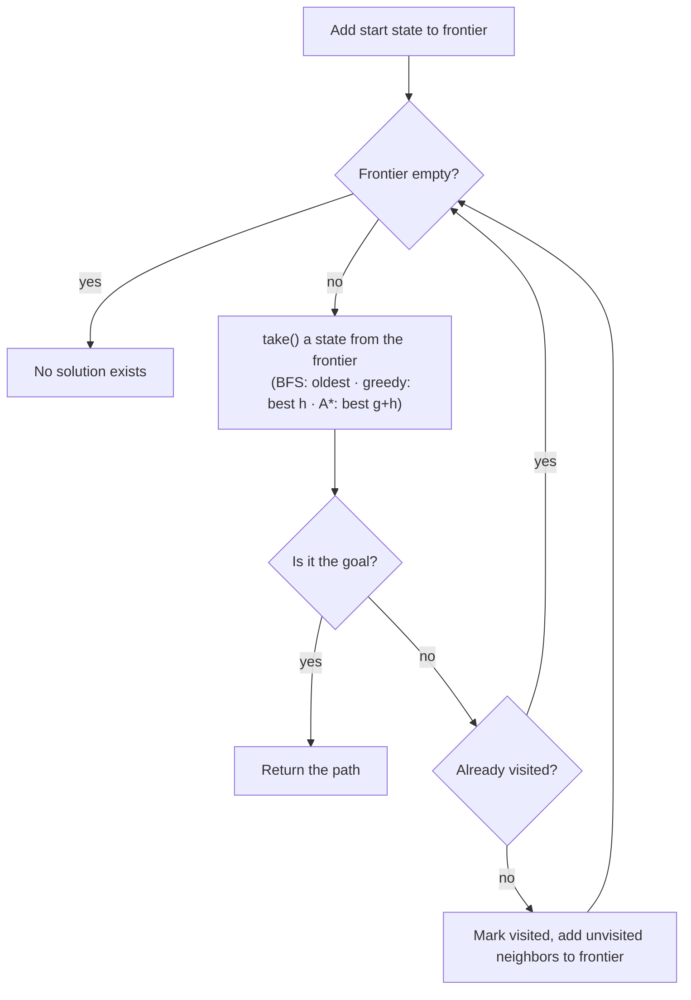

# Flowcharts and diagrams

> **Milestone 2.** These are [Mermaid](https://mermaid.js.org/) diagrams — plain text that GitHub renders as pictures automatically. Edit the text, refresh the page, see the diagram. Three starters below: adapt each to your project, don't start from nothing. For the report, screenshot the rendered diagrams.

## 1. System flowchart

How one request moves through your system. This starter shows a customer placing an order — rename the boxes to match your project's main flow (a reservation, a member registration, an event request):

📖 Read: [How HTTP servers work](https://learn.kevalabs.com/web-fundamentals/how-http-servers-work/) · [How Django works](https://learn.kevalabs.com/python/django/how-django-works/) — this diagram is those two guides in one picture; you should be able to narrate every arrow.

## 2. ER diagram (data model)

Your entities and how they relate. This starter shows a generic shape — replace it with the entities from your `project-pack.md`, one block per Django model you'll write:

Reading `||--o{`: "one CATEGORY contains zero-or-many ITEMs." Get the crow's feet right — the external examiner *will* ask why a line is one-to-many.

📖 Read: [PostgreSQL 101](https://learn.kevalabs.com/databases/postgresql-101/) (keys and relationships) · [How ORMs work](https://learn.kevalabs.com/python/fundamentals/how-orms-work/) (how these blocks become Django model classes).

## 3. AI algorithm flowchart

The flowchart of your algorithm. **Search teams** (Cafe, Restaurant, Party Palace): this is the frontier loop — it's the same for BFS, greedy, and A*; annotate which `take()` yours uses and what your states/goal are. **Gym team:** replace it with the backward-chaining flow (goal → find rule → prove conditions → ask if leaf).

📖 Read: [How AI search works](https://learn.kevalabs.com/ai/how-search-algorithms-work/) *or* [How expert systems work](https://learn.kevalabs.com/ai/how-expert-systems-work/) — the interactive simulators in those guides step through these exact diagrams.
